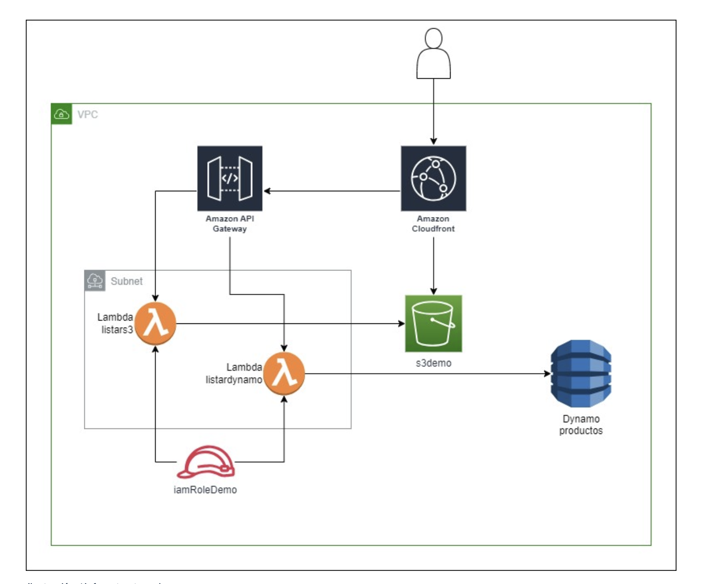

********  CÓMO IMPLEMENTAR Y REPLICAR EL ESCENARIO *********

Antes de empezar se debe tener configurado las credenciales de aws correctamente para la ejecución de scripts. Además tener instalado aws cli, Boto3 y Python3.
 
Ej: 

[default]
aws_access_key_id=<Tu_access_key_id>
aws_secret_access_key=<Tu_secret_access_key>

1. Crear Stack Bucket S3: 

Use el archivo "stack_s3.yaml" para crear primero el bucket S3. Ingrese a CloudFormation, Crear Stack, Upload a template file y escoja el archivo en el root de este proyecto llamado "stack_s3.yaml", next, Ponle un nombre (Recomiendo StackS3), Next y Submit. 
Esperar a que se cree el stack completamente y el bucket S3.

2. Subir archivos ZIP a bucket S3:

Para que no falle la app y el flujo se deben subir los zip del index.html, index.py de las lambdas listardynamo y listars3. Todo ello se obtiene corriendo el script1_upload_s3.sh ; validar que se está en el root del proyecto y correr el sgte comando:

        sh script1_upload_s3.sh

3. Crear Stack Principal y resto de recursos

Una vez se validen los pasos 1 y 2, se usa el archivo "stack_main.yaml" para crear el resto de recursos. Ingrese a CloudFormation, Crear Stack, Upload a template file y escoja el archivo en el root de este proyecto llamado "stack_main.yaml", next, Ponle el nombre OBLIGATORIO "resources" (YA QUE SI NO SE USA ESTE NOMBRE, EL SCRIPT2 EN PASOS POSTERIORES FALLARÍA), Next y Submit. 
Esperar a que se cree el stack completamente.

4. Disponibilizar el Cloudfront con su Origin access

En orden de tener el Cloudfront disponible y acceder a su dominio para permitir visualizar el contenido del html, se debe correr el sgte script en python siempre y cuando el stack principal en cloudformation tenga por nombre "resources". Corra el sgte comando: 

        python3 script2_cloudfront.py

Una vez termine exitosamente el script, por favor recargar la página de cloudformation y acceder al stack de "resources", outputs y buscar la de nombre "CloudFrontURL = http://${CloudFrontDistribution.DomainName}/index.html", dándole click al contenido de esta. Ej de contenido de output: http://dpu6dbsps34mz.cloudfront.net/index.html       
        

5. Poblar DynamoDB Productos con registros

Para este objetivo se debe situar en la raíz del proyecto y correr el script3_populate_DB.py con el sgte comando: 

    python3 script3_populate_DB.py

Una vez se ejecuta exitosamente, ingresar al servicio de Dynamo DB en la consola de AWS, recargar página, buscar en tables la llamada "productos", explore table Items y podrás ver 2 registros con los datos solicitados en este objetivo.

6. Testing desde postman los endpoints API Gateway

Esto dependerá desde donde requieras usarlo, pero por elección usé Postman. Adjunto en este proyecto, la colección que usé con nombre "TestApi". Una vez descargues la colección, importala desde postman. Hay 3 endpoints creados de esta manera:

 * GET - Cloudfront domain Index html 
 * GET - Test Api Dynamo Items
 * POST - Api Test S3 Items with Apikey

* GET - Cloudfront domain Index html: Este endpoint es para consumir el Cloudfront una vez esté disponibilizado con los pasos anteriores. Obtendrás una respuesta status code 200 si todo salió bien. Adjunto evidencias en el proyecto. 

 * GET - Test Api Dynamo Items: Método GET que trae los registros de la DynamoDB "productos" en formato Json. Si reproduciste los pasos anteriores exitosamente deberías obtener un status code 200 con el contenido de los registros en formato Json. Adjunto evidencias en el proyecto.

* POST - Api Test S3 Items with Apikey: Método POST que trae los objetos que contiene el bucket s3 "s3demomanve". Para este método, se solicita en el header del request un campo llamado "x-api-key". Para ingresar debes hacer lo sgte; Situarse en el método POST Api Test S3 Items with Apikey, irse al aparto de headers, buscar el campo "x-api-key" y poner al frente el valor. Cómo obtengo este valor?

* Obtener valor de api-key: Dirigirse al servicio de Apigateway de AWS, Buscar en la columna izquierda el apartado API Keys, copiar el valor en el apartado API key y pegarlo como valor al campo "x-api-key" de postman para el método POST. Guardar cambios y luego enviar. 
Si todo fue configurado correctamente, deberías obtener un status code 200 con la respuesta de los items de bucket s3. 

7. Evidences

Existe una carpeta en el root de este proyecto llamada "evidences". Dentro de ella se encuentran 2 carpetas que se dividen así.

 * Resources: En este se encuentran imagenes de los recursos creados para este proyecto.

 * Tests: En él se encuentran los tests realizados para validar que el proyecto cumple con el objetivo que se pide.

8. Repositorio y versionamiento del proyecto

En orden de seguir con las buenas prácticas, este proyecto fue publicado en mi perfil de GitHub como un proyecto privado al cual se le dará accesos a las personas involucradas para su posterior review, feedback, sugerencias o respectivos ajustes. Así como también se adjunta una imagen de la Arquitectura de los componentes de este proyecto.

 * URL Github Proyecto: https://github.com/manveira/AWS_Project
 * Usuario Github: https://github.com/manveira

Notes: 

* No se le pudo nombrar al bucket S3 "s3demo" porque este nombre ya está siendo usado a nivel global en toda la infraestructura de AWS. Como se sabe, el servicio de S3 es un servicio global donde cada nombre de bucket debe ser único e irrepetible en todo el globo, por ende se optó por nombrar al bucket de S3 "s3demomanve" en lugar de "s3demo". 

* El componente CloudFrontOriginAccessIdentity en la propiedad "Tags" no es valido en este recurso. Es decir ese componente de AmazonCloudFront no permite tags.

* El componente API Gateway en la propiedad "Tags" no es valido en este recurso. Es decir ese componente de permite tags.

* Aunque no se crearon componentes de networking como subnet, security groups, etc.... Se creó una VPC para los recursos.

* El tema de los Roles de las lambdas no fue muy claro así que se optó por crear un mismo role compartido para ambas Lambdas. Cómo buena práctica lo mejor es que cada componente tenga su role aislado para cerrar brechas de posibles vulnerabilidades expuestas y segmentar en la mejor medida la interacción entre recursos.                            
